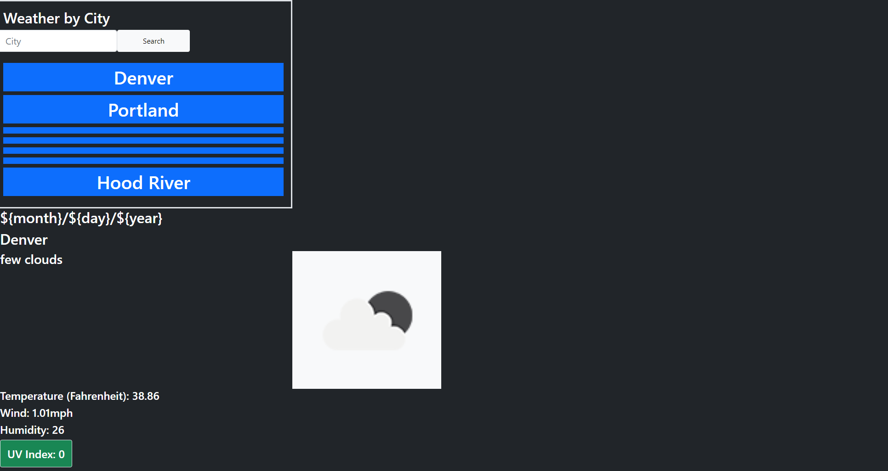

# weather-plotter

## Purpose
A simple application that shows a day to day weather forecast. You can search by city and it will give a visual of what the weather looks like in an intuitive image.

## Built with
* HTML
* CSS
* JavaScript
* Bootstrap
* openweather API

## Website
https://zaclark369.github.io/weather-plotter/

## Screenshot
The websites landing page.
   

## Contribution
Made by Zachary Clark
* https://github.com/zaclark369

### ©️2021 
